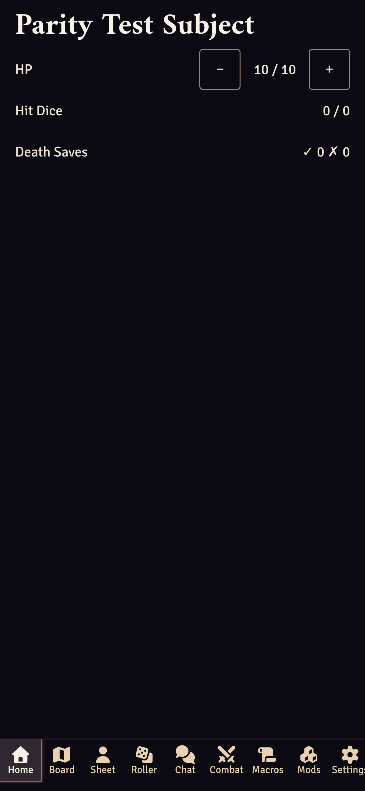
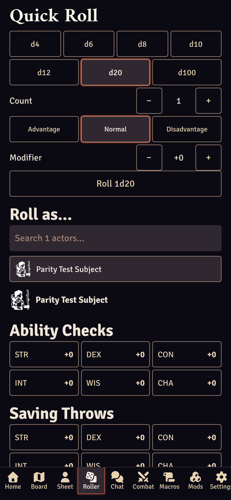
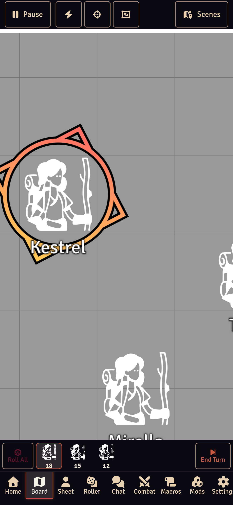
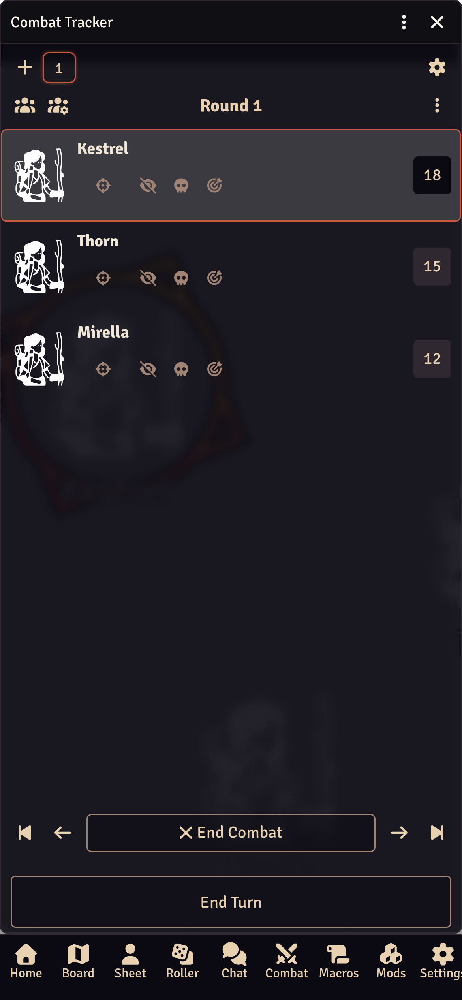

# TapTable

**Play Foundry VTT from your phone or tablet. Sheets, dice, combat, and the game board, all built for touch.**

> **Not affiliated with or endorsed by Foundry Gaming LLC.** "Foundry VTT" / "Foundry Virtual Tabletop" are trademarks of Foundry Gaming LLC; TapTable is an independent module for Foundry VTT.

<!-- TODO: add the character-sheet screenshot from the device pass -->
|  |  |  |  |
|:---:|:---:|:---:|:---:|
| Home | Roller | Board | Combat |

## Why TapTable?

Foundry VTT is built for a desktop browser. A lot of play happens away from one: a player at an in-person table with only a phone, a tablet propped next to a battlemat, someone joining from the couch. On a small screen the stock UI fights you. Windows overflow, the keyboard covers what you're typing, and drag-and-drop just doesn't work.

TapTable wraps your world in a phone-shaped interface so the things you actually do at the table work with a thumb: check your sheet, roll dice, move your token, take your combat turn.

## Features

**Made for your phone**
- A bottom nav bar that stays in thumb reach: Home, Board, Sheet, Roller, Chat, Combat, Macros, Mods, Settings
- Available in 6 languages: English, Français, Deutsch, Español, Português (Brasil), Italiano
- The on-screen keyboard never hides what you're typing
- Built for spotty wifi. If the connection drops, TapTable reconnects on its own.

**Touch-first play**
- Drag-and-drop that actually works on a touchscreen
- Pinch, pan, and tap your way around the game board
- Touch-friendly combat with token controls, targeting, multi-select, and a turn-order carousel right on the board
- Run your hotbar macros with a tap

**Dice at your fingertips**
- Quick-roll dice builder. Just pick your dice, add a modifier, and roll.
- "Roll as…" lets you roll with any character's modifiers

> **Desktop players won't notice a thing.** TapTable automatically detects phone-sized devices and only switches on there. Your desktop layout, screen space, and mouse-and-keyboard experience stay exactly as they are.

## Installation

**Foundry package browser** (once listed): search for "TapTable" in **Add-on Modules → Install Module** and click Install.

**Manifest URL**: in **Add-on Modules → Install Module**, paste this into the Manifest URL field:

```
https://github.com/harvog-builds/taptable/releases/latest/download/module.json
```

Then enable TapTable in your world's module settings.

TapTable switches on automatically on phones. On a tablet, open module settings and set **TapTable Mode** to "Force phone UI". Each player controls this for their own device.

## System support

**D&D 5e: deep integration out of the box.**
- The character sheet, patched for touch
- HP and vitals on your Home screen, with quick plus and minus buttons
- Favorites for one-tap use of your go-to items and abilities
- Ability checks, saving throws, and skills as one-tap rolls
- Roll initiative from your phone
- Browse compendiums by familiar categories (spells, items, feats, and more)
- Place spell and ability templates by tap

**Every other game system: the essentials just work.** The phone interface, game board, dice roller, chat, combat tracker, and macros all work out of the box, no setup needed. Panels that need system knowledge, like the sheet summary, simply stay out of your way.

More deep integrations are on the way, and community adapters are welcome. There's a note for developers at the bottom.

## Compatibility & feedback

Works with **Foundry VTT v14**.

Phones and tablets vary wildly, and TapTable is young. We'd love your real-world feedback. If a button is out of reach or a menu looks wonky on your device, [open an issue](https://github.com/harvog-builds/taptable/issues) with your device, browser, and Foundry version so we can patch it!

## Support the project

- Found a bug or have a request? [GitHub issues](https://github.com/harvog-builds/taptable/issues)
- Want to support development? [Join the Patreon](https://www.patreon.com/Harvog). Tavern Friends get the news, and Party Members get every premium module as it lands.

## Contributing

- **Translations.** TapTable ships in English, French, German, Spanish, Brazilian Portuguese, and Italian. Want yours added? Copy [`lang/en.json`](lang/en.json), translate the values, keep every `{placeholder}` intact, and open a pull request.
- **Device feedback.** The most valuable thing you can give right now. See [Compatibility & feedback](#compatibility--feedback) above.

## License

MIT. See [LICENSE](LICENSE); third-party notices live in [NOTICE](NOTICE).

---

**For developers:** Want TapTable to work deeply with your favorite game system? Check out [ADAPTERS.md](ADAPTERS.md).
